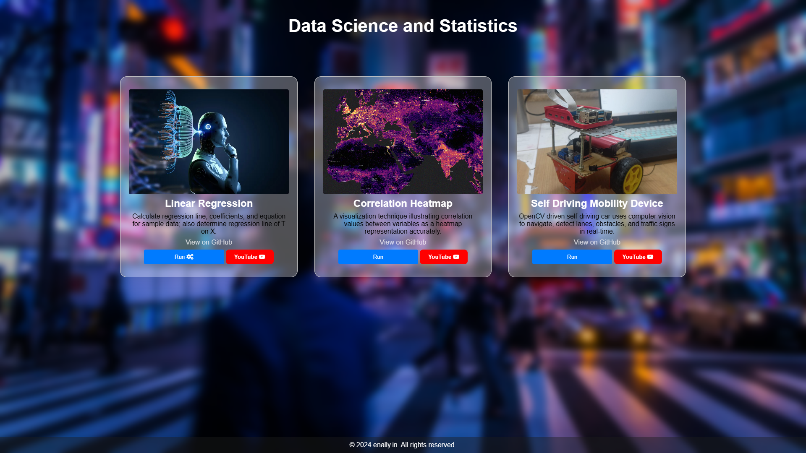

# Data Science Projects

Welcome to the Data Science Projects Repository! This repository hosts a collection of diverse projects showcasing various data science techniques and applications. Below are brief descriptions of the projects included:

...

## Linear Regression
Implementing linear regression analysis to calculate the regression line, coefficients, and equations for given sample data. Additionally, this project determines the regression line of T on X, providing insights into the relationship between variables.

[View on GitHub](link_to_github_linear_regression) | [Run on YouTube](https://www.youtube.com/@07Sushant.)

## Correlation Heatmap
Explore the correlation between variables through a heatmap visualization technique. This project accurately illustrates correlation values, aiding in understanding relationships within the dataset.

[View on GitHub](link_to_github_correlation_heatmap) | [Run on YouTube](https://www.youtube.com/@07Sushant.)

## Self Driving Mobility Device
Embark on a journey into the realm of autonomous vehicles with this self-driving mobility device project. Leveraging OpenCV, this system employs computer vision to navigate, detect lanes, obstacles, and traffic signs in real-time, showcasing the potential of AI in mobility solutions.

[View on GitHub](link_to_github_self_driving_mobility_device) | [Run on YouTube](https://www.youtube.com/@07Sushant.)

Feel free to explore, contribute, and utilize these projects for learning and experimentation purposes. For any inquiries or suggestions, please don't hesitate to reach out.
